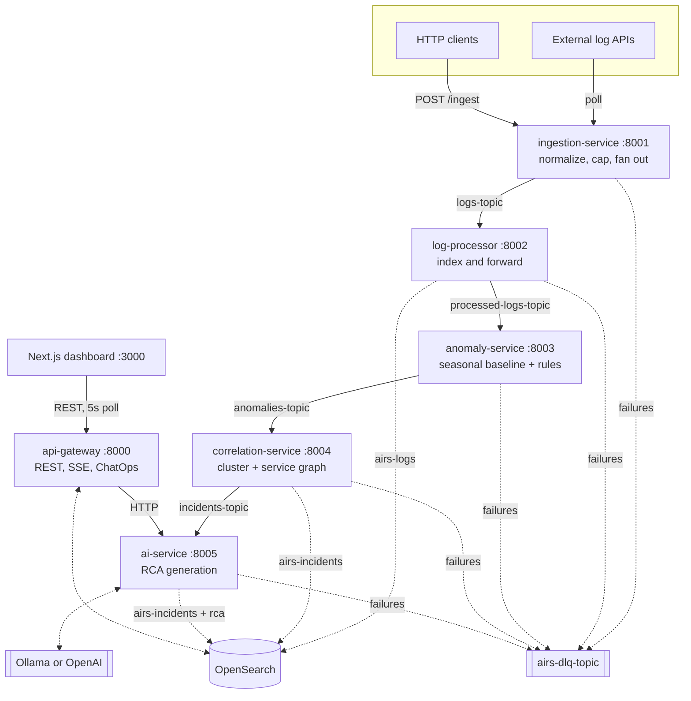

# 02: Architecture

Six services, five Kafka topics, one OpenSearch cluster. Every stage is a
separate consumer group, so a stage can fall behind or fall over without
propagating backpressure to the stage in front of it.

---

## The pipeline

The single most important property of this shape: **incidents exist
independently of the model.** correlation-service writes a complete incident
to OpenSearch and publishes it before ai-service has seen it. RCA is an
enrichment applied afterwards. A model outage costs you an explanation, never
an incident.

---

## Services

### ingestion-service (8001)

The only entry point. Everything downstream trusts that what is on
`logs-topic` is a valid `NormalizedLogEvent`, and this service is what makes
that true.

| | |
| --- | --- |
| Consumes | nothing from Kafka |
| Produces | `logs-topic`, `airs-dlq-topic` |
| Reads | `airs-sources` |
| Writes | `airs-sources` (poll status) |
| State | HTTP client, background poll task |

Three intake paths converge on one function:

- `POST /ingest` takes a batch. Accepts objects or bare strings.
- `POST /sources/{id}/pull` forces an immediate poll of one configured source.
- A background loop ticks every `source_poll_tick_seconds` (5s), lists enabled
  sources from OpenSearch, and polls those whose `poll_interval_seconds` has
  elapsed.

Normalization accepts almost anything: a bare string becomes a log line
attributed to `unknown-service`, and any keys that are not part of the
envelope are preserved under `metadata`. What it will not do is guess at a
timestamp it cannot parse. Events that fail normalization, and events over
`max_log_payload_kb` (256 KB), are published to the DLQ and the rest of the
batch continues.

### log-processor (8002)

| | |
| --- | --- |
| Consumes | `logs-topic`, group `airs-log-processor` |
| Produces | `processed-logs-topic`, `airs-dlq-topic` |
| Writes | `airs-logs` |
| State | none |

Indexes every event for search, then forwards it. The document id is derived
from tenant, service, timestamp and a message hash, which makes re-ingestion
of the same event idempotent at the index level.

It applies the `log_retention_days` (5) ISM policy to `airs-logs` at startup.
If the OpenSearch Index State Management plugin is absent, the call fails
silently and retention becomes your problem. That is deliberate, so the
service still starts on a stripped-down OpenSearch, but it means retention is
best-effort rather than guaranteed.

This service is the throughput bottleneck of the ingest path. It indexes with
`refresh=True` on every event, forcing a refresh per document. See
[06-evals.md](06-evals.md).

### anomaly-service (8003)

Where "what is normal for this service" lives.

| | |
| --- | --- |
| Consumes | `processed-logs-topic`, group `airs-anomaly-service` |
| Produces | `anomalies-topic`, `airs-dlq-topic` |
| Reads | `airs-rules`, `airs-suppressions` (refreshed every 30s) |
| State | **in-memory baselines**, per `(tenant_id, service)` |

Each service gets a `ServiceSeasonalBaseline`: 24 hour-of-day slots, each an
EWMA of per-minute event counts with EWMA variance alongside it (alpha 0.3).
The z-score for an event compares the current minute's count against the slot
for that hour. A service busy at 09:00 and quiet at 03:00 is not flagged for
being busy at 09:00.

Two consequences worth stating plainly:

- **It is a volume baseline, not an error-rate baseline.** It counts every
  event. A service that doubles its info-level chatter looks anomalous.
- **A slot returns nothing until it has been seen before.** Cold start means
  no z-score for a given hour until that hour has passed once. The keyword and
  level gates carry detection until then, which is most of the reason emission
  is a disjunction rather than a threshold.

An event is emitted as an anomaly if any of: a detection rule matched, a
keyword matched, the level is error/critical/fatal, or the z-score crosses
`anomaly_threshold`. It is then dropped anyway if confidence lands below 0.3
and no rule matched.

Suppression windows are applied **here**, before an anomaly exists. A
suppressed signal never reaches correlation.

### correlation-service (8004)

Turns a stream of anomalies into a much smaller stream of incidents.

| | |
| --- | --- |
| Consumes | `anomalies-topic`, group `airs-correlation-service` |
| Produces | `incidents-topic`, `airs-dlq-topic` |
| Reads | `airs-sources` (60s cache), `airs-topology` |
| Writes | `airs-incidents` |
| State | **in-memory clusters**, per `(tenant_id, service)` |

Two correlation axes:

**Time window.** Anomalies for a service accumulate into a cluster. The window
defaults to `correlation_window_minutes` (10) and can be overridden per
service by the `window_duration_minutes` on its data source. Repeat
fingerprints deduplicate and extend the window. The cluster emits an incident
when it first reaches `min_signal_count` (2), or immediately if an anomaly is
critical.

The cluster then **stays resident** for the rest of its window. Later
anomalies amend the incident already open rather than minting another, with
the incident id, `created_at` and parent link stable across amendments.
Amendments are republished to Kafka only on severity escalation, so a growing
incident does not cost one RCA per anomaly.

**Service graph.** When an incident opens, the service's neighbours are looked
up in `airs-topology`, and an open incident on any of those neighbours in the
last 30 minutes becomes its parent. This is what collapses "five services are
all on fire" into one parent with four children. The graph is declared by an
operator through `PUT /v1/topology`; it is not inferred.

### ai-service (8005)

| | |
| --- | --- |
| Consumes | `incidents-topic`, group `airs-ai-service` |
| Produces | `airs-dlq-topic` |
| Reads | `airs-incidents`, `airs-sources`, `airs-suppressions`, `airs-topology` |
| Writes | `airs-incidents` (RCA upsert), `airs-rca-feedback` |
| Calls | Ollama or OpenAI |

Context assembly is the part that matters more than the prompt. For each
incident it gathers the timeline, the last five incidents for the same
service, active suppression windows, the service's topology edges, its source
metadata, and the top 15 log lines with critical and fatal prioritised.
"Similar incidents last week" is often the difference between a useful RCA and
a generic one.

Routing is by severity: `critical` to the primary model, `warning` to the
low-cost model, `info` to the deterministic path with no model call at all.

The fallback chain is: primary model with retries, then the low-cost model
with retries, then a deterministic template. It also covers a provider that
cannot be constructed, such as OpenAI selected with no API key present. There
is no configuration under which an incident reaching this service fails to
receive an RCA.

Provider selection is a runtime concern. `POST /config` swaps provider and
model with no restart.

### api-gateway (8000)

| | |
| --- | --- |
| Consumes | nothing from Kafka |
| Produces | `logs-topic` (simulate and replay paths) |
| Reads/writes | every OpenSearch index |
| Calls | ai-service over HTTP |

41 versioned routes under `/v1`, each also mounted unversioned for
convenience. Incident CRUD with cursor pagination, source management,
detection rules with back-testing against stored logs, suppression windows,
topology, webhooks, ChatOps, audit log, replay and the synthetic load
generator.

`GET /v1/stream` is Server-Sent Events over a 2-second OpenSearch poll. It is
push transport over a polling source. The shipped dashboard does not use it
and polls REST at 5 seconds instead.

There is no authentication on any of it. See
[01-scope-and-non-goals.md](01-scope-and-non-goals.md).

---

## Shared contract layer

`shared/airs_shared` is the single source of truth, imported by all six
services:

| Module | Responsibility |
| --- | --- |
| `models.py` | Every Pydantic model. The data contract. |
| `settings.py` | YAML config loading with layered candidate paths |
| `kafka.py` | Produce helper that validates against the topic contract first |
| `schema_registry.py` | Topic to model mapping, served over the API |
| `opensearch.py` | Client, index creation, ISM retention |
| `normalize.py` | Raw input to `NormalizedLogEvent` |
| `dlq.py` | DLQ envelope construction |
| `monitoring.py` | Prometheus response helper |

The important one is `kafka.produce_json`, which validates the payload against
the registered model for that topic **before** publishing. A service cannot
put a malformed event on a topic even by accident. That is why every consumer
can deserialize without defensive parsing.

---

## Data stores

| Index | Written by | Contents |
| --- | --- | --- |
| `airs-logs` | log-processor | Every normalized event, 5 day retention |
| `airs-incidents` | correlation-service, ai-service | Incidents and their RCA, 30 day retention |
| `airs-sources` | ingestion-service, api-gateway | External log endpoint config and poll status |
| `airs-rules` | api-gateway | Operator detection rules |
| `airs-suppressions` | api-gateway | Maintenance windows |
| `airs-topology` | api-gateway | Service dependency edges |
| `airs-rca-feedback` | ai-service | RCA ratings and corrections (written, never read) |
| `airs-audit` | api-gateway | Mutating API operations |

Redis is a startup and health dependency of ai-service and api-gateway and is
currently read and written by neither. It is provisioned ahead of RCA caching
and rate limiting.

---

## Startup ordering

Compose gates every service on the health of what it actually touches at
startup, which includes OpenSearch for any service calling `ensure_index()`.
Container healthchecks use `/health/live`, deliberately: `/health/ready`
reports dependency health, and gating container restarts on that would restart
ai-service whenever the model was unreachable, which is precisely the case the
deterministic fallback exists to survive.

---

Previous: [01: Scope and non-goals](01-scope-and-non-goals.md) | Next: [03: Decisions](03-decisions.md)
